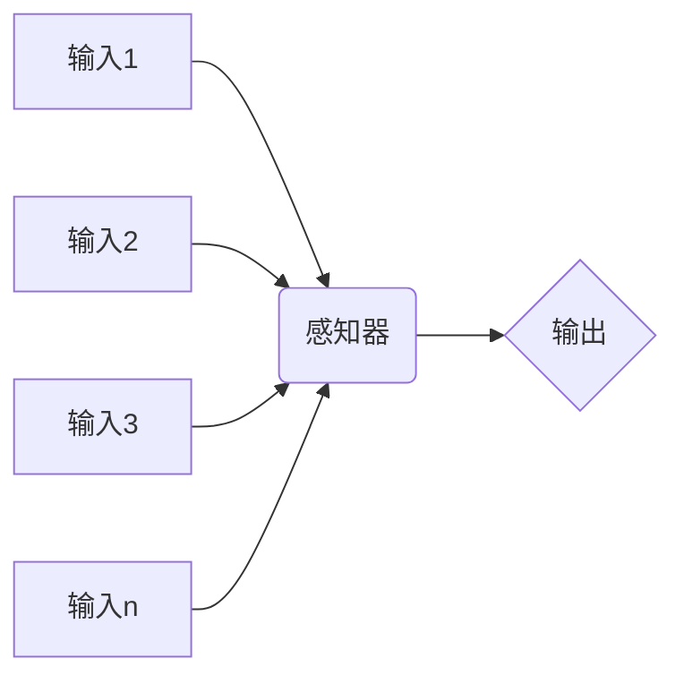
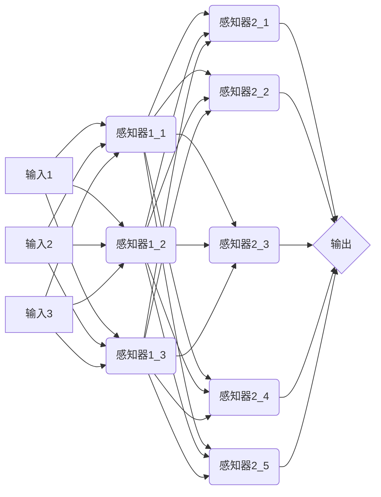
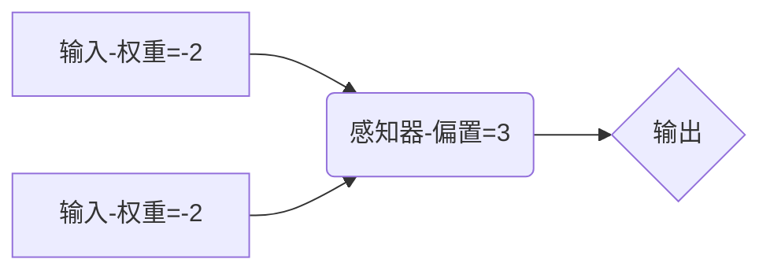

# 神经⽹络与深度学习-学习笔记

> Source: http://neuralnetworksanddeeplearning.com/
>
> numpy: https://www.numpy.org.cn/index.html
>
> github: https://github.com/mnielsen/neural-networks-and-deep-learning/
>
> First Edit: 2019/05/16
>
> Last Edit: 2019/05/16
>
> author: Leon

## 前言

- 神经⽹络，⼀种美妙的受⽣物学启发的编程范式，可以让计算机从观测数据中进⾏学习
- 深度学习，⼀个强有⼒的⽤于神经⽹络学习的众多技术的集合
- 两种重要的人工神经元：感知器、S型神经元
- 标准的神经⽹络学习算法：随机梯度下降算法
- 点乘 dot：w · x = w1\*x1 + w2\*x2 + w3\*x3 + …
- 矩阵点乘 dot: 结果矩阵R第 n 行 m 列的值为矩阵A第 n 行所有数据与矩阵B第 m 列所有数据按顺序两两相乘之和
  - 结果矩阵R=[矩阵A的行数,矩阵B的列数]，需要矩阵A的第二维度数量等于矩阵B的第一维度数量。
  - 例如 [[1,2],[3,4]] · [[5,6],[7,8]] = [[1\*5+2\*7,1\*6+2\*8],[3\*5+4\*7,3\*6+4\*8]] = [[19,22],[43,50]]
  - 例如 [[1,2,3],[4,5,6]] · [[A,B,C,D],[E,F,G,H],[I,J,K,L]]=[[1A+2E+3I,1B+2F+3J,1C+2G+3K,1D+2H+3L],[4A+5E+6I,4B+5F+6J,4C+5G+6K,4D+5H+6L]]
- 矩阵乘法: 两个矩阵相同坐标的数值相乘后放置于结果矩阵的相同位置
  - 矩阵A和矩阵B尺寸相等
  - 例如 [1,2,3] * [1,2,3] = [1,4,9]
- exp: 以自然常数e为底的指数函数 

## 第 1 章 使⽤神经⽹络识别⼿写数字

### 1.1 感知器

​	⼀个感知器接受多个⼆进制输⼊，x1, x2, . . .，每个输入拥有对应的实数权重，w1,w2,…，并产⽣⼀个⼆进制输出。神经元的输出，0 或者 1，则由分配权重后的总和⼩于或者⼤于⼀些阈值决定。和权重⼀样，阈值是⼀个实数，⼀个神经元的参数。

$$
output=\begin{cases} 0 \quad \sum_{j}{w_j}{x_j} \leq threshold \\ 1 \quad \sum_{j}{w_j}{x_j} > threshold \end{cases}
$$
​	随着权重和阈值的变化，可以得到不同的决策模型。

​	我们改写"∑"操作为"点乘"，并使用实数"偏置"替换"阈值"，偏置越大越容易输出1。可以化简公式为：
$$
output=\begin{cases} 0 \quad w·x+b \leq 0 \\ 1 \quad w·x+b > 0 \end{cases}
$$

​	第一层感知器根据权衡所有的输入做出决定；第二层感知器根据权衡所有第一层感知器的输出做出决定；后一层的感知器可以比前一层的感知器做出更加复杂的决定；

> 上图中虽然前一层的感知器指向了多个后一层感知器，但前一层感知器的输出依然只有一个，只是将同一个输出结果输入了多个后一层感知器。

**演示：**

​	这个感知器：输入 (0,1) 时，0\*-2+1\*-2+3=1；输入 (1,1) 时，1\*-2+1\*-2+3=-1；输入 (0,0) 时，0\*-2+0\*-2+3=3；即实现了与非门。

​	当这个感知器使用的两个输入实际来源自同一个结果的话，它等同于：

​	可以设计**学习算法**，使其自动调整**权重(w)**和**偏置(b)**，这个学习算法也是传统逻辑门与人工神经元的根本区别。

### 1.2 S 型神经元

​	σ(z) 又称逻辑函数，S型神经元又称逻辑神经元。

​	⽹络中单个感知器上⼀个权重或偏置的微⼩改动有时候会引起那个感知器的输出完全翻转，如 0 变到 1。那样的翻转可能接下来引起其余⽹络的⾏为以极其复杂的⽅式完全改变。**S 型神经元和感知器类似，但是被修改为权重和偏置的微⼩改动只引起输出的微⼩变化**。

​	S型神经元的输入可以是0~1之间的任一实数；

​	S型神经元的输出是 σ(w · x+b)：
$$
代入\quad
\sigma(z)≡\frac{1}{1+e^{-z}}
\quad即得\quad
\sigma(w·x+b)≡\frac{1}{1+exp(-\sum_{j}{w_j}{x_j}-b)}
$$

$$
公式(1) \quad e^{-z} = \frac{1}{e^z}
$$

​	当 z 是一个无限大的正数时，公式(1)无限趋近于0，而 σ(z) 无限趋近于1；

​	当 z 是⼀个无限小的负数时，公式(1)无限趋近于∞，而 σ(z) 无限趋近于0；

​	以上两种情况 S 型神经元的行为都与感知器类似。

​	σ 的平滑意味着权重和偏置的微⼩变化，即 ∆wj 和 ∆b，会从神经元产⽣⼀个微⼩的输出变化 ∆output。实际上，微积分告诉我们 ∆output 可以很好地近似表⽰为：
$$
\Delta output \approx \sum_{j}{\frac{\partial output}{\partial w_j} \Delta w_J + \frac{\partial output}{\partial b} \Delta b}
$$
​	求和是在所有权重w上进行的，而 ∂ output/∂wj 和 ∂ output/∂b 是 output 对 wj 和 b 的偏导数。

### 1.3 神经⽹络的架构

​	神经网络中最左侧的一层为输入层，最右侧的一层为输出层，而中间的既非输入也非输出的层为**隐藏层**，越是复杂的神经网络，其中的隐藏层数就越多。

​	相⽐于神经⽹络中输⼊输出层的直观设计，隐藏层的设计则堪称⼀⻔艺术。特别是，**通过⼀些简单的经验法则来总结隐藏层的设计流程是不可⾏的**。相反，神经⽹络的研究⼈员已经为隐藏层开发了许多设计最优法则，这有助于⽹络的⾏为能符合⼈们期望的那样。

​	**前馈神经⽹络：以上⼀层的输出作为下⼀层的输⼊。**

​	**递归神经网络：神经元间存在反向反馈环路。**更接近人脑工作原理，也适于解决一些特定问题，但目前学习算法不够强大。

### 1.4 ⼀个简单的分类⼿写数字的⽹络

​	使用三层神经网络：28*28=784个输入神经元、15个隐藏层神经元、10个输出神经元。

​	输入：0~1的实数代表像素的灰度值，0.0=白色，1.0=黑色。

​	输出：10个输出神经元分别对应0-9的是个数字，输出神经元的输出越接近1，则识别结果越接近输出神经元对应的数字。

### 1.5 使⽤梯度下降算法进⾏学习

​	我们需要的第一样东西：用来学习的数据集——训练数据集：http://yann.lecun.com/exdb/mnist/

> - train-images-idx3-ubyte.gz: 训练集图像(9912422 bytes)
>
> - train-labels-idx1-ubyte.gz: 训练集标签 (28881 bytes)
>
> - t10k-images-idx3-ubyte.gz: 测试集图像 (1648877 bytes)
>
> - t10k-labels-idx1-ubyte.gz: 测试集标签 (4542 bytes)

​	还需要一个与训练数据集不同的测试集，用来验证。

​	还需要一个学习算法，帮助我们找到每个神经元合适的输入权重和偏置，使得这套权重和偏置能拟合所有的输入。

​	为了量化上述的目标，我们引入一个 代价函数：
$$
C(w,b) \equiv \frac{1}{2n}\sum_{x}{∥y(x)-a∥^2}
$$
​	其中：

> - w为网络中所有权重的集合，
> - b为所有的偏置，
> - n为训练数据的个数，
> - x为输入，
> - y(x)为神经网络计算函数，
> - a为输入为x时的输出向量，
> - ∥v∥ 是指向量 v 的模。

​	C函数成为二次代价函数，也叫均方误差或MSE，结果是一个非负数。代价函数结果越接近于0，即对于每个输入x，y(x)都无限趋近于a时，说明权重和偏置数据越合适。所以我们可以使用梯度下降方式使代价函数尽可能小。

​	**我们训练神经网络的目的是得到能够最小化二次代价函数C(w,b)的权重和偏置，而我们使用的技术就是 阶梯下降，梯度下降法可以被视为⼀种在 C 下降最快的⽅向上做微⼩变化的⽅法。**

​	人们研究出了多种计算梯度下降的算法，但是都有一个致命弱点：都需要计算C代价函数变量数量的平方数量级的二阶偏导。

​	一种加速学习算法：随机梯度下降。思想是随机选择少量训练样本估算梯度，有助于加速梯度下降，并加速学习。
$$
\nabla C \approx \frac{1}{m} \sum_{j=1}^{m} \nabla C_{x_{j}}
$$

### 1.6 实现我们的⽹络来分类数字

> Python 代码演示

**复杂的算法 ≤ 简单的学习算法 + 好的训练数据**

### 1.7 迈向深度学习

​	通过⼀系列多层结构来完成，在前⾯的⽹络层，它回答关于输⼊图像⾮常简单明确的问题，在后⾯的⽹络层，它建⽴了⼀个更加复杂和抽象的层级结构。包含这种多层结构 —— 两层或更多隐藏层 —— 的⽹络被称为**深度神经⽹络**。

​	现实往往会使用多个隐藏层的神经网络处理复杂的任务，就像传统编程中的多层，把任务抽象为多层，更够表现的更加出色。

## 第 2 章 反向传播算法如何工作

> 数学知识较多，可跳过此章，而将 “反向传播” 当做一个黑盒。

​	反向传播，计算代价函数的梯度的快速算法。

​	反向传播的核⼼是⼀个对代价函数 C 关于任何权重 w（或者偏置 b ）的偏导数 ∂C/∂w 的表达式。这个表达式告诉我们在改变权重和偏置时，代价函数变化的快慢。

### 2.1 热⾝：神经⽹络中使⽤矩阵快速计算输出的⽅法

$$
b^l \quad =第l层神经元的偏置集合 \quad b_j^l \quad =第l层第j个神经元的偏置
$$

$$
a_j^l \quad =第l层第j个神经元的激活值
$$

$$
w^l \quad =第l层神经元给前一层神经元的权重矩阵 \quad w_{jk}^l \quad =第l层第j个神经元给前一层第k个神经元的权重
$$

$$
z_j^l \quad =第l层第j个神经元的带权输入
$$

​	**带权输入** = [当前神经元的所有输入乘以每个输入对应的权重]+[当前神经元的偏置]

​	**激活值** = 激活函数(带权输入)

### 2.2 关于代价函数的两个假设

#### 2.2.1 第一个假设

​	代价函数可以被写成⼀个在每个训练样本 x 上的代价函数 C 的均值。
$$
C= \frac{1}{n} \sum_{x}{C_x}
$$

#### 2.2.2 第二个假设

​	代价可以写成神经⽹络输出的函数。

### 2.3 Hadamard 乘积，s ⊙ t

​	特别地，假设 s 和 t 是两个同样维度的向量。那么我们使⽤ s ⊙ t 来表⽰按元素的乘积。

### 2.4 反向传播的四个基本⽅程

### 2.5 四个基本⽅程的证明

### 2.6 反向传播算法

1. 输入x
2. 前向传播
3. 输出层误差 δ
4. 反向误差传播
5. 输出

### 2.7 代码

### 2.8 在哪种层⾯上，反向传播是快速的算法？

### 2.9 反向传播：全局观

## 第 3 章 改进神经⽹络的学习⽅法
